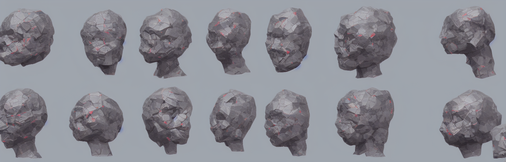
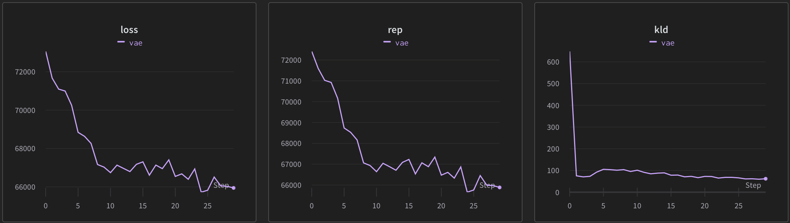

vae

A PyTorch implementation of [Auto-Encoding Variational Bayes](https://arxiv.org/pdf/1312.6114.pdf)




 
### Installation
```
git clone https://github.com/andregaio/dcgan.git
cd vae
conda create -n vae python=3.8
conda activate vae
pip install -r requirements.txt
```

### Dataset
[MNIST](https://pytorch.org/vision/0.15/generated/torchvision.datasets.MNIST.html)


### Models
 - VAE


### Training
```
python vae/train.py
```

### Inference
```
python vae/infer.py --weights weights/last.pt --out test/image.png
```

### [Results](https://wandb.ai/andregaio/vae)
<div align="center">





</div>

### Notes
 - Some has been borrowed from https://github.com/Jackson-Kang/Pytorch-VAE-tutorial/tree/master
